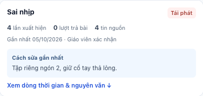
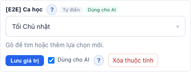
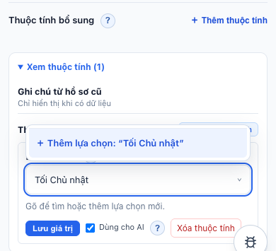

# Hướng dẫn kiểm thử end to end hồ sơ học viên

Ứng dụng trợ lý Pancake • Kết quả thực hiện ngày 06/10/2026

Tài liệu hướng dẫn người vận hành kiểm thử các chức năng của kế hoạch hồ sơ học viên và tiến độ chấm bài bằng giao diện web. Hãy chạy các luồng theo thứ tự để dữ liệu bài tập, tin nộp, lỗi và ghi nhớ nối tiếp nhau.

Đợt kiểm thử đã thực hiện 31 ca qua UI. Ba tên thật được dùng để xác nhận tìm kiếm, mở hồ sơ và đọc lịch sử. Những thao tác cần tạo/sửa dữ liệu được chạy trên tài khoản [TEST] trong SQLite riêng. AI trong môi trường test trả nội dung cố định để kiểm tra luồng nghiệp vụ và nguồn dữ liệu.

| Nội dung | Kết quả quan sát |
| --- | --- |
| UI desktop và mobile | 31/31 ca đạt; desktop 1440 × 1000, mobile 390 × 844 và ngang 844 × 390. |
| Pancake thật | Tìm được Anh Võ, DanPhuong Tran và Vu Thi Huong Lien. DanPhuong Tran tải từ 30 lên 120 tin. |
| Backend | 33/33 kiểm thử đạt. Build frontend và backend đạt. |
| Phạm vi còn chờ | Chất lượng Gemini trên nội dung thật, gửi thật qua Pancake và đo tải/độ trễ sản xuất. |

Dùng bộ demo đã có dữ liệu tại http://127.0.0.1:5181/ để xem các chức năng. Để chạy lại từ đầu, mở một môi trường mới theo hướng dẫn trang sau. Kết quả trong bảng cuối tài liệu là kết quả của đợt 06/10/2026, không thay cho kết quả của lần chạy lại.

Tài liệu đối chiếu: PLAN_HO_SO_HOC_VIEN_VA_TIEN_DO_CHAM_BAI.md trong thư mục docs.

## Chuẩn bị môi trường kiểm thử

Mở Terminal ở thư mục gốc chatbot_TTD. Backend và frontend cần được cài dependencies của dự án. Các lệnh dưới đây tạo SQLite tạm, session nhân viên test và dữ liệu tổng hợp; không cần token Pancake hoặc API key thật.

```bash
FIXTURE_SCENARIO=manual-e2e \
FIXTURE_BACKEND_PORT=4011 \
FIXTURE_FRONTEND_PORT=5182 \
node backend/tests/run-fixture-ui.mjs
```

1. Đợi dòng “Fixture UI: http://127.0.0.1:5182/”. Mở địa chỉ này trong Orca hoặc trình duyệt. Tài khoản staff-test/page-test được đăng nhập tự động ở chế độ test.

2. Kiểm tra nhãn AI là openai / fixture-chat và Backend sẵn sàng. Đây là phản hồi giả lập, không gọi nhà cung cấp AI thật. Nếu cổng 4011 hoặc 5182 đang dùng, thay cả hai bằng cổng trống.

3. Dữ liệu tạm bắt đầu ở trạng thái ban đầu khi chạy một tiến trình mới. Ctrl+C dừng runner và xóa DB tạm. Muốn chạy lại toàn bộ luồng, dừng runner rồi chạy lại lệnh.

Nếu muốn giữ dữ liệu test qua lần khởi động, dùng filename riêng bắt đầu bằng manual-e2e. Để làm sạch DB test đã giữ, thêm FIXTURE_RESET=1 khi khởi động, sau khi đã dừng runner đang dùng file đó.

```bash
FIXTURE_DATABASE_PATH=storage/manual-e2e-demo.db \
FIXTURE_SCENARIO=manual-e2e \
FIXTURE_BACKEND_PORT=4011 FIXTURE_FRONTEND_PORT=5182 \
node backend/tests/run-fixture-ui.mjs
```

Môi trường thật ở http://127.0.0.1:5180/ dùng token nhân viên được cấp trong màn hình đăng nhập. Token không nằm trong tài liệu. Chỉ dùng các thao tác đọc cho dữ liệu thật trong đợt này; toàn bộ thao tác tạo dữ liệu của hướng dẫn dùng bộ [TEST].

Ghi lại ngày chạy D. Khi test ngày hết hiệu lực, dùng D−1 cho ghi nhớ hết hiệu lực và D+7 cho ghi nhớ hiện hành. Mốc bài Minuet là 01/10/2026; số ngày hiển thị phải thay đổi theo ngày chạy, không luôn bằng 5.

## Dữ liệu mẫu và cách chọn nguồn

| Tài khoản | Dùng để kiểm thử |
| --- | --- |
| [TEST] Anh Võ | 82 tin; bài Minuet, nhiều lỗi theo mốc, chấm bài và mở nguồn cũ. |
| [TEST] DanPhuong Tran | Ghi nhớ, sự kiện, riêng tư, xung đột, đề xuất và thuộc tính dropdown. |
| [TEST] Vũ Thị Hương Liên | Đề xuất lỗi, cách sửa, học viên tự báo đã sửa và kết luận giáo viên. |
| [TEST] Gia đình An Bình | Tin cũ của An và tin mới của Bình; nguồn giáo viên ở hội thoại khác. |

| Tin có thể tìm trong ô nguồn | Nội dung cần nhận diện |
| --- | --- |
| MỐC 01 — học viên | Em gửi bài Minuet đoạn ô nhịp 16. Em đang bị kẹt đoạn này. |
| MỐC 01 — Giáo viên Test | Em sai nhịp và cổ tay thấp ở ô nhịp 16. Tập chậm với metronome tempo 50. |
| MỐC 02 — học viên | Em vẫn sai nhịp ở ô nhịp 16 khi tập Minuet. |
| MỐC 03 — Giáo viên Test | Sai nhịp, cổ tay thấp và ngón 2 trượt phím; tập riêng ngón 2, giữ cổ tay thả lỏng. |
| MỐC 03 BỔ SUNG | Cổ tay thấp trong cùng lần tập vừa nhận xét. |
| MỐC 04 | Giáo viên xác nhận đã sửa sai nhịp và vượt đoạn ô nhịp 16. |
| MỐC 05 | Giáo viên báo lại sai nhịp ở đoạn mới. |

Ô nguồn cho tìm theo ngày, người nói và nội dung. Nhập marker như MỐC 01, rồi chọn đúng dòng Giáo viên Test hoặc học viên. Hai tin cùng marker có thể thuộc hai người nói khác nhau.

Đợi thông báo tải tin và xác định học viên của tin kết thúc trước khi chọn nguồn. Nếu tin cần dùng không có, bấm “Tải tin nhắn cũ hơn” rồi mở lại ô chọn. Khi nhập căn cứ nguyên văn, giữ đúng chữ trong nguồn; không tự viết câu khác vào phần trích dẫn.

## Luồng 1 Tìm người và tải lịch sử

1. Trong thanh tìm kiếm hội thoại, nhập [TEST] Anh Võ và mở hội thoại. Trên mobile, bấm Học viên ở thanh dưới trước khi tìm; sau khi chọn, bấm Trợ lý AI để mở các tab.

2. Kiểm tra tiêu đề chat và tên trên bảng trợ lý đúng người. Chuyển qua [TEST] DanPhuong Tran rồi quay lại Anh Võ để kiểm tra hồ sơ/thuộc tính không bị trộn.

3. Ngay dưới tiêu đề chat có số tin đã tải và nút Tải tin nhắn cũ hơn. Bấm, đợi số tin đổi rồi mới bấm tiếp. Bộ Anh Võ đi từ 30 → 60 → 82 tin. Khi hết lịch sử, nút tải thêm biến mất.

4. Bấm tab Hồ sơ và thử icon ? cạnh Bài đang học. Hướng dẫn mở ra; bấm Đã hiểu hoặc Escape để đóng. Escape trong một dropdown chỉ đóng danh sách đó.

5. Khi tìm một người chưa xuất hiện trong danh sách đã tải, bấm Tải thêm hội thoại. Ô tìm kiếm lọc cả tên học viên, tên tài khoản và nội dung xem trước; có thể nhập không dấu.

Kết quả mong đợi: tổng số tin trên UI không bị chặn ở 30; không xuất hiện tin trùng khi tải tiếp; vị trí đọc được giữ khi chèn tin cũ; mở chat lấy đúng hồ sơ. Mỗi API tin của Pancake vẫn trả một trang khoảng 30 tin theo thiết kế API.

| Dữ liệu thật đã kiểm tra | Quan sát ngày 06/10/2026 |
| --- | --- |
| Anh Võ | Hai hội thoại tìm được có 1 và 4 tin. |
| DanPhuong Tran | Trang đầu 30 tin; ba lần tải tiếp lên 120 tin, gồm tin học viên và nhân viên. |
| Vu Thi Huong Lien | Ba hội thoại cùng tên, mỗi hội thoại được mở có 1 tin. |
| Tìm tên cũ | Đã tải 1.080 hội thoại qua các trang để tìm đủ ba tên. |

Ca được đối chiếu: E2E-01, E2E-02, E2E-19.

## Luồng 2 Bài tập tin nộp và trả bài

1. Ở Hồ sơ của [TEST] Anh Võ, bấm Thêm bài. Nhập [E2E] Minuet ô nhịp 16 và lưu. Khi chưa biết ngày, để trống; đừng lấy ngày hôm nay làm mốc giả.

2. Mở Chỉnh sửa bài, chọn ngày bắt đầu 01/10/2026. Căn cứ: MỐC 01 — Em gửi bài Minuet đoạn ô nhịp 16. Em đang bị kẹt đoạn này. Bấm Lưu bài tập.

3. Bấm Ghi nhận bài nộp. Chọn tin MỐC 01 của học viên và chọn bài Minuet. Nếu chỉ có một bài đang tập, bài đó được chọn sẵn; vẫn kiểm tra lại trước khi lưu.

4. Bấm Chấm bài này. Kiểm tra ô Bài đang tập và Tin nộp bài đã chọn đúng. Nhập: Ô nhịp 16 em sai nhịp và cổ tay thấp. Tập chậm với metronome tempo 50.

5. Bấm Soạn 3 phương án nhận xét. Có ba phương án để duyệt. Quay lại Hồ sơ: số lượt đã gửi vẫn bằng 0; bản nháp không được tính là đã trả bài.

6. Trở lại Chấm bài, soạn lại cùng nhận xét và nguồn. Sau đó bấm Đã gửi nhận xét qua Pancake để mô phỏng đã gửi trong môi trường test. Trong môi trường thật chỉ bấm sau khi đã gửi qua Pancake.

Kết quả mong đợi: một lượt trả bài đã xác nhận; soạn lại cùng yêu cầu không tạo thêm lượt; bài nộp không còn nằm trong danh sách chờ sau khi xác nhận gửi. AI ở bước này chỉ diễn đạt nhận xét bạn nhập, không chứng minh đã xem video.


Ca được đối chiếu: E2E-03, E2E-04, E2E-05. Số ngày 5 trong ảnh là quan sát ngày 06/10/2026; lịch sử thiếu phải có nhãn ít nhất.

## Luồng 3 Nhiều lỗi theo nhiều mốc

1. Vào Hồ sơ → Theo dõi lỗi → Ghi nhận lỗi. Với mỗi dòng bảng dưới, nhập tên lỗi, chọn tin nguồn đúng người nói, giữ trích nguyên văn, chọn loại xác nhận và gắn với bài Minuet.

| Tên lỗi | Mốc và loại nguồn | Cách sửa có thể nhập |
| --- | --- | --- |
| Sai nhịp | MỐC 01; Giáo viên đã xác nhận | Tập chậm với metronome tempo 50. |
| Cổ tay thấp | MỐC 01; Giáo viên đã xác nhận | Tập chậm với metronome tempo 50. |
| Sai nhịp | MỐC 02; Học viên tự báo | Để trống; không nhập toa giáo viên từ lời học viên. |
| Sai nhịp | MỐC 03; Giáo viên đã xác nhận | Tập riêng ngón 2, giữ cổ tay thả lỏng. |
| Cổ tay thấp | MỐC 03; Giáo viên đã xác nhận | Tập riêng ngón 2, giữ cổ tay thả lỏng. |
| Ngón 2 trượt phím | MỐC 03; Giáo viên đã xác nhận | Tập riêng ngón 2, giữ cổ tay thả lỏng. |

2. Xem cả ba bộ lọc Cần theo dõi, Gần đây và Tất cả. Mở Sai nhịp để xem mốc 01, 02, 03 và nguyên văn; mốc 02 mang nhãn học viên tự báo.

3. Mở Cổ tay thấp → mốc 03 → Chỉnh mốc / thêm căn cứ → Gắn thêm tin. Chọn MỐC 03 BỔ SUNG và lưu. Nhập lại Cổ tay thấp từ MỐC 03 để thử chống trùng.

Kết quả mong đợi trước khi thêm mốc 05: có ba lỗi riêng, số lần 3–2–1. Thêm căn cứ hoặc nhập lại cùng nguồn không tăng số lần. Số tin nguồn có thể tăng, còn số lượt trả bài là chỉ số riêng; ghi mốc thủ công không tự gắn vào một review session.

Ca được đối chiếu: E2E-06, E2E-07.

## Luồng 4 Chỉnh mốc sửa lỗi và hoàn thành bài

1. Mở Cổ tay thấp → mốc gần nhất → Chỉnh mốc / thêm căn cứ → Gộp / tách lỗi. Nhập [E2E] Cổ tay cần theo dõi riêng rồi Chuyển mốc. Lỗi mới có một mốc; lỗi cũ còn một mốc.

2. Mở lỗi mới, chuyển mốc về tên Cổ tay thấp. Lỗi cũ trở lại hai mốc. Hồ sơ lỗi đích có thể vẫn hiện với 0 lần để giữ dấu vết; không coi đó là một lần mắc mới.

3. Mở Sai nhịp → Xác nhận đã sửa. Căn cứ: MỐC 04 — Em đã sửa lỗi sai nhịp và vượt đoạn ô nhịp 16 của Minuet. Lỗi biến mất ở Cần theo dõi nhưng còn trong Tất cả.

4. Ghi thêm Sai nhịp từ tin giáo viên MỐC 05. Trạng thái chuyển Tái phát và số lần lên 4. Ảnh bên dưới là trạng thái sau bước này, không phải mốc 3–2–1 ban đầu.

5. Trong mốc 05, mở Chỉnh mốc / thêm căn cứ → Loại khỏi thống kê. Số lần giảm còn 3 nhưng nguyên văn vẫn còn. Mở mục này lại rồi Khôi phục mốc; số lần trở lại 4.

6. Quay về Bài tập, bấm Đã vượt bài, nhập căn cứ MỐC 04 và xác nhận hoàn thành. Chọn Đã hoàn thành để xem; bấm Mở lại bài và quay sang Đang tập. Lượt trả bài đã gửi vẫn giữ nguyên.



Ca được đối chiếu: E2E-08, E2E-09, E2E-10, E2E-11.

## Luồng 5 Ghi nhớ hiệu lực và riêng tư

1. Mở [TEST] DanPhuong Tran → Ghi nhớ. Với ghi chú cũ chưa xác nhận, bấm Xác nhận nội dung. Nhãn chưa xác nhận mất đi; nội dung gốc không tự bị viết lại.

2. Thêm Yêu cầu / xưng hô với nội dung [E2E] Hãy gọi em là Phương. Chọn nguồn chứa Hãy gọi em là Phương. và lưu.

3. Thêm Sự kiện: [E2E] Chuẩn bị biểu diễn piano cuối tuần. Mở Hiệu lực & quyền dùng cho AI, chọn D+7; để quyền dùng cho AI bật nếu muốn kiểm tra gợi ý.

4. Thêm Sự kiện: [E2E] Chuyện gia đình riêng tư. Bật Thông tin riêng tư / nhạy cảm. Nhãn phải là Riêng tư · không dùng cho AI.

5. Thêm Lưu ý cách học: [E2E] Chỉ áp dụng hướng dẫn cũ đến ngày hôm qua. Chọn D−1. Mục này nằm ở Hết hiệu lực, không nằm trong Hiện hành.

6. Lưu trữ ghi nhớ riêng tư, mở bộ lọc Lưu trữ và Khôi phục. Nó quay lại Hiện hành nếu còn hiệu lực; việc khôi phục không tự gia hạn ngày hết hiệu lực.

7. Thêm yêu cầu thứ hai: [E2E] Hãy gọi em là Phương thử. Khi có mâu thuẫn, chọn Áp dụng yêu cầu này ở tên Phương ban đầu, nhập căn cứ đã đối chiếu nguồn rồi xác nhận.

Kết quả mong đợi: hai yêu cầu mâu thuẫn chưa đồng thời được AI dùng; ghi nhớ hết hiệu lực/lưu trữ/riêng tư có nhãn không dùng cho AI; ghi nhớ cũ cần được duyệt trước.


Ca được đối chiếu: E2E-12, E2E-13, E2E-14, E2E-15.

## Luồng 6 Đề xuất và gợi ý chat

1. Ở Hồ sơ của DanPhuong Tran, mở Đề xuất. Bấm Đọc tin mới nếu chưa thấy đề xuất. Worker có thể đã tạo đề xuất trước khi bấm; kiểm tra nguồn thay vì đòi số lượng tăng mỗi lần.

2. Đề xuất Lưu ý cách học có nguồn Em thích được hướng dẫn từng bước. Chọn Sửa rồi duyệt; lưu [E2E] Ưu tiên hướng dẫn từng bước, mỗi bước ngắn. Ở đề xuất yêu cầu gọi tên trùng với thông tin đã nhập, chọn Từ chối.

3. Bấm Đọc tin mới lần nữa. Những tin đã xử lý không tạo thêm bản đề xuất trùng. Mở Ghi nhớ để thấy nội dung đã chỉnh và duyệt.

4. Mở Gợi ý → Tạo gợi ý. Mở Dữ kiện hồ sơ đã dùng. Phải thấy yêu cầu gọi Phương và ghi nhớ đã duyệt còn hiệu lực; không có ghi nhớ riêng tư hoặc hết hiệu lực.

5. Chọn Dán vào ô soạn ở phương án đầu. Khi khung nháp đã có nội dung, chọn phương án khác: thử Chèn thêm vào cuối, Hủy, rồi Ghi đè toàn bộ. Hủy phải giữ nguyên nháp; ghi đè phải thay toàn bộ.

Môi trường mock kiểm tra được việc tạo ba phương án, quyền dùng dữ kiện và thao tác đưa vào nháp. Các câu cố định trong mock không dùng để kết luận Gemini hiểu đúng tên gọi, lỗi kỹ thuật hoặc sự kiện. Trên môi trường thật cần người vận hành đọc lại từng câu.

Ca được đối chiếu: E2E-16, E2E-29, E2E-30.

## Luồng 7 Thuộc tính có dropdown mở rộng

1. Mở Hồ sơ của DanPhuong Tran, bấm ＋ Thuộc tính ngay đầu hồ sơ. Tên thuộc tính: [E2E] Ca học. Dạng thông tin: Danh sách lựa chọn. Lựa chọn ban đầu: Sáng, Chiều. Tạo thuộc tính.

2. Ở ô chọn của thuộc tính, nhập Tối thứ 7. Chọn ＋ Thêm lựa chọn: “Tối thứ 7”. Giá trị được thêm vào danh sách và được lưu làm giá trị hiện tại trong cùng một lần cập nhật.

3. Tải lại trang, mở lại người này và Xem thuộc tính. Tối thứ 7 vẫn được chọn và có trong danh sách. Chọn mục đã có, như Sáng, thì bấm Lưu giá trị.

4. Thử checkbox Dùng cho AI. Sau khi lưu xong, trạng thái vẫn giữ khi tải lại. Icon ? giải thích: quyền này cho AI đọc giá trị đã lưu khi soạn gợi ý chat; AI chưa tự điền thuộc tính từ tin nhắn.

5. Chuyển sang Anh Võ. Thuộc tính [E2E] Ca học của Phương không xuất hiện trong hồ sơ Anh Võ. Bấm Làm mới rồi kiểm tra lại đúng người và giá trị đang chọn.



Ca được đối chiếu: E2E-17, E2E-18, E2E-19, E2E-31.

## Luồng 8 Duyệt lỗi và kết luận giáo viên

1. Mở [TEST] Vũ Thị Hương Liên → Hồ sơ → Đề xuất. Bộ mock đã nạp bốn đề xuất để kiểm thử từng loại nguồn.

2. Duyệt đề xuất Lỗi kỹ thuật [E2E] Giữ nhịp đều trước. Sau đó duyệt đề xuất Cách sửa với nội dung tập metronome tempo 40. Cách sửa phải gắn vào lỗi vừa tạo.

3. Ở đề xuất Xác nhận đã sửa có nguồn Em nghĩ em đã giữ nhịp đều rồi., bấm Duyệt. Phải bị chặn và hiện lỗi yêu cầu nguồn giáo viên. Đây là kết quả mong đợi của ca âm tính, không phải lỗi hệ thống.

4. Từ chối đề xuất tự báo của học viên. Duyệt đề xuất có nguồn Giáo viên xác nhận Liên đã giữ nhịp đều khi luyện âm giai.

5. Mở Theo dõi lỗi → Tất cả. Lỗi có trạng thái Đã sửa và cách sửa metronome đã được giữ. Ở Cần theo dõi nó không còn xuất hiện.

Kết quả mong đợi: nguồn học viên và nguồn giáo viên được phân biệt; lời tự báo không được chuyển thành kết luận đã sửa. Bộ đề xuất này được nạp bằng mock để kiểm tra thao tác duyệt, không chứng minh AI trích xuất đúng trên hội thoại thật.

Ca được đối chiếu: E2E-27.

## Luồng 9 Tài khoản dùng chung và mở căn cứ cũ

1. Tìm Tài khoản dùng chung hai con. Mở hội thoại của [TEST] Bình. Trong Ghi nhận bài nộp, ô nguồn chỉ cho chọn tin của Bình; các tin Student A không được dùng cho Bình.

2. Trước khi đổi người, mở Theo dõi lỗi → Relax wrist → nguyên văn → Xem tin nguồn. Hội thoại giáo viên cũ không nằm trong trang danh sách đầu vẫn mở được, và tin Keep your wrist relaxed. được làm nổi bật.

3. Quay lại tài khoản dùng chung. Mở Cài đặt hồ sơ & lịch sử → Điều chỉnh liên kết hồ sơ. Chọn [TEST] An và Liên kết học viên. Trong ô nguồn, chỉ có tin Student A; các tin cũ của Bình vẫn thuộc Bình.

4. Tìm hội thoại có xem trước Hồ sơ riêng của An. Ở Điều chỉnh liên kết hồ sơ, nhập [TEST] Học viên C mới, chọn Tạo học viên rồi Tạo và liên kết hồ sơ. Chấm bài không được giữ nhận xét hay phương án của người trước.

5. Để thử mở một tin rất cũ của Anh Võ, tải hết 82 tin rồi thêm ghi nhớ kiểm thử với nguồn TIN CŨ 01. Tải lại trang: chỉ còn trang đầu. Vào ghi nhớ, mở Xem căn cứ → Xem tin nguồn. Tin cũ phải được tải từ cache và làm nổi bật.

Các phần điều chỉnh liên kết dành cho tài khoản thực sự có nhiều người học. Không tự gộp hai hồ sơ chỉ vì cùng tên. Sau khi bấm đổi người, chờ hồ sơ và nguồn cập nhật rồi mới lưu.

Ca được đối chiếu: E2E-20, E2E-21, E2E-22, E2E-24.

## Luồng 10 Lỗi nhập liệu và sửa đồng thời

1. Ở Anh Võ → Ghi nhận lỗi, chọn một nguồn giáo viên có sẵn. Nhập Trích nguyên văn: Đoạn này không có trong tin nguồn. Bấm Lưu lần xuất hiện.

2. Phải hiện lỗi trích dẫn không khớp, kèm mã tra cứu. Hủy biểu mẫu; lỗi mới không được tạo. Bấm icon bug ở góc dưới phải để xem lỗi, rồi Xóa lỗi.

3. Mở hai tab cùng UI test và cùng bài Minuet. Ở cả hai tab, mở Chỉnh sửa trước khi lưu ở tab nào.

4. Tab A đổi tên thành [E2E] Minuet ô nhịp 16 — bản mới và lưu. Tab B đổi thành ... — ghi chồng rồi lưu. Tab B phải bị chặn do dữ liệu đã thay đổi; đây là lỗi 409 mong đợi.

5. Ở tab B, Hủy rồi mở lại Chỉnh sửa để thấy dữ liệu tab A. Không bấm lặp để ghi đè bản cũ. Có thể trả tên bài về tên ban đầu sau khi đã ghi nhận kết quả.

6. Trong Cài đặt hồ sơ & lịch sử, mở phạm vi lịch sử và bấm Đồng bộ thêm lịch sử. Tin đã lưu và các lượt trả bài vẫn còn; nhãn phạm vi phải phù hợp dữ liệu đã đồng bộ.

Kết quả mong đợi: thao tác không hợp lệ không tạo dữ liệu một phần; tab cũ không ghi đè tab mới; lỗi có thể xem trong icon bug. Nếu thấy 429/503 từ AI thật, ghi là bị chặn bởi nhà cung cấp, không đánh dấu chất lượng gợi ý là đạt.

Ca được đối chiếu: E2E-23, E2E-25, E2E-28.

## Luồng 11 Mobile và kết thúc lần test

1. Mở UI test ở viewport 390 × 844. Bấm Học viên → tìm DanPhuong Tran → chọn hội thoại → Trợ lý AI → Hồ sơ.

2. Bấm ＋ Thuộc tính và icon ? của Cách điền thuộc tính. Hướng dẫn phải đọc được; đóng hướng dẫn rồi Hủy biểu mẫu thêm mới nếu chỉ muốn xem thuộc tính cũ.

3. Trong [E2E] Ca học, nhập Tối Chủ nhật, chọn Thêm lựa chọn và đợi thông báo đã lưu. Danh sách tự mở lên/xuống theo khoảng trống; không tràn ngang.

4. Đổi sang viewport 844 × 390 để kiểm tra màn hình ngang. Có thể chuyển Học viên, Tin nhắn và Trợ lý AI bằng thanh điều hướng dưới.



Ca được đối chiếu: E2E-26. Khi chạy lại, ghi kết quả riêng cho phiên bản và ngày chạy của bạn. Nếu dùng DB tạm, Ctrl+C dừng runner và xóa dữ liệu; nếu dùng DB test được giữ, cần chủ động reset trước một lần chạy từ đầu.

Dừng ở đây nếu mục tiêu là kiểm thử UI. Nghiệm thu hiệu năng p50/p95, nhiều instance, backup/restore và migration cần các bài kiểm thử vận hành riêng.

## Kết quả thực hiện ngày 06 tháng 10 năm 2026 phần 1

Các ca dưới đây được thực hiện bằng thao tác UI. PASS ở ca âm tính nghĩa là hệ thống chặn đúng thao tác không hợp lệ.

| Ca | Chức năng | Kết quả |
| --- | --- | --- |
| E2E-01 | Tải toàn bộ lịch sử vượt 30 tin | PASS |
| E2E-02 | Hướng dẫn tại chỗ bằng icon ? | PASS |
| E2E-03 | Tạo và sửa bài với ngày bắt đầu có căn cứ | PASS |
| E2E-04 | Gắn tin nộp với bài đang học | PASS |
| E2E-05 | Chấm bài tạo lại không trùng lượt; chỉ tính sau xác nhận gửi | PASS |
| E2E-06 | Ba lỗi riêng có số lần 3–2–1 và nguồn học viên/giáo viên riêng | PASS |
| E2E-07 | Thêm căn cứ và nhập lại cùng tin không tăng số lần | PASS |
| E2E-08 | Xác nhận đã sửa, giữ lịch sử và ghi nhận lỗi gặp lại | PASS |
| E2E-09 | Tách một mốc sang lỗi mới và gộp lại đúng lỗi cũ | PASS |
| E2E-10 | Loại và khôi phục mốc, nguyên văn vẫn còn | PASS |
| E2E-11 | Hoàn thành và mở lại bài, giữ lượt trả bài | PASS |
| E2E-12 | Duyệt ghi nhớ chuyển từ dữ liệu cũ | PASS |
| E2E-13 | Ghi nhớ riêng tư, lưu trữ và khôi phục | PASS |
| E2E-14 | Ghi nhớ hết hiệu lực được lọc riêng | PASS |
| E2E-15 | Phát hiện mâu thuẫn xưng hô và chọn thông tin đúng | PASS |
| E2E-16 | Đề xuất AI có nguồn; sửa trước khi duyệt, từ chối và đọc lại không trùng | PASS |

## Kết quả thực hiện ngày 06 tháng 10 năm 2026 phần 2

| Ca | Chức năng | Kết quả |
| --- | --- | --- |
| E2E-17 | Tạo thuộc tính dropdown và lưu lựa chọn mới | PASS |
| E2E-18 | Lựa chọn thuộc tính giữ sau tải lại và bật quyền AI đọc giá trị | PASS |
| E2E-19 | Đổi hội thoại không trộn thuộc tính/hồ sơ người khác | PASS |
| E2E-20 | Mở nguồn đã lưu nằm ngoài trang 30 tin hiện tại | PASS |
| E2E-21 | Tài khoản chung đổi người học nhưng tin cũ giữ đúng chủ sở hữu | PASS |
| E2E-22 | Tạo học viên mới trong ô chọn và xóa ngữ cảnh chấm bài cũ | PASS |
| E2E-23 | Từ chối trích dẫn sai; icon bug có mã lỗi; dữ liệu không được ghi | PASS |
| E2E-24 | Mở căn cứ ở hội thoại ngoài danh sách mới nhất | PASS |
| E2E-25 | Hai tab sửa cùng bài: tab cũ bị chặn 409, không ghi đè | PASS |
| E2E-26 | Mobile 390 và ngang 844: hướng dẫn, dropdown thêm mới, không tràn ngang | PASS |
| E2E-27 | Duyệt đề xuất lỗi/cách sửa/đã sửa; chặn lời tự báo của học viên | PASS |
| E2E-28 | Đồng bộ lịch sử qua UI giữ dữ liệu và cập nhật phạm vi | PASS |
| E2E-29 | Tạo gợi ý chat dùng ghi nhớ duyệt; usedFacts không có riêng tư/hết hiệu lực | PASS |
| E2E-30 | Dữ kiện AI đã dùng hiển thị; chọn gợi ý, chèn thêm, hủy và ghi đè nháp | PASS |
| E2E-31 | Làm mới danh sách vẫn giữ đúng hồ sơ và thuộc tính đang chọn | PASS |

Bằng chứng và kết quả chi tiết: docs/qa/manual-e2e-2026-10-06/results.json và các ảnh figure trong cùng thư mục.

Các sửa phát sinh: phân trang current_count của Pancake; tải tiếp hội thoại và tìm không dấu/tên tài khoản; đọc nguồn vượt 50 tin; hiển thị đúng trạng thái hết hiệu lực; checkbox quyền AI; kiểm tra nguồn giáo viên khi duyệt đã sửa; giữ hồ sơ sau Làm mới; hiển thị dữ kiện hồ sơ đã dùng.

Phạm vi chưa nghiệm thu: chất lượng AI thật trên hội thoại thực, gửi thật qua Pancake, độ ổn định dài hạn của API, tải nhiều người dùng và triển khai nhiều instance. Các câu AI cố định trong demo chỉ kiểm tra luồng.


