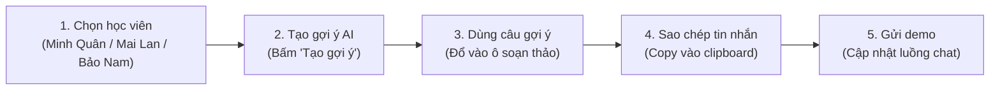

# Giao Diện Demo AI Copilot Phản Hồi Pancake - Lớp Nhạc Thầy Minh 🎹

Giao diện người dùng (Frontend) xây dựng bằng **React 18**, **TypeScript**, và **Vite** dành cho nhân viên/trợ giảng tại Lớp Nhạc Thầy Minh. Ứng dụng hỗ trợ đọc luồng hội thoại học viên, phân loại mức độ nhạy cảm, nhận gợi ý phản hồi chuẩn văn phong Thầy Minh và sao chép/gửi demo phản hồi nhanh chóng.

> [!IMPORTANT]
> **LƯU Ý QUAN TRỌNG VỀ PHẠM VI DEMO:**
> - Frontend đã đọc danh sách hội thoại và lịch sử tin nhắn Pancake thông qua backend demo.
> - **CHƯA GỬI TIN NHẮN THẬT** đến học viên qua Fanpage/Zalo.
> - Nút **Gửi demo** chỉ gọi backend lưu phản hồi local vào JSONL, không gọi API gửi tin của Pancake.

---

## 📑 Mục Lục
1. [Yêu cầu Môi trường](#1-yêu-cầu-môi-trường)
2. [Cài đặt & Khởi chạy](#2-cài-đặt--khởi-chạy)
3. [Kiến trúc Thư mục Frontend](#3-kiến-trúc-thư-mục-frontend)
4. [Kịch bản Demo 5 Bước (Core Flow)](#4-kịch-bản-demo-5-bước-core-flow)
5. [Dữ liệu 3 Ca Mẫu Nghiệp Vụ](#5-dữ-liệu-3-ca-mẫu-nghiệp-vụ)
6. [Checklist Kiểm Thử Toàn Diện (QA Test Checklist)](#6-checklist-kiểm-thử-toàn-diện-qa-test-checklist)

---

## 1. Yêu cầu Môi trường

- **Node.js**: Phiên bản 18.x hoặc 20.x trở lên
- **Package Manager**: **pnpm** (khuyến nghị `pnpm v11+` hoặc `pnpm v12+`)

---

## 2. Cài đặt & Khởi chạy

Chạy backend trước ở một terminal:

```bash
cd /home/truongdb/Desktop/AI_Music/ChatBot_TuVan/backend
pnpm dev
```

Sau đó chạy frontend ở terminal khác trong thư mục `ChatBot_TuVan/frontend`:

```bash
cd /home/truongdb/Desktop/AI_Music/ChatBot_TuVan/frontend
```

### 2.1. Cài đặt dependencies
Cài đặt toàn bộ thư viện cần thiết bằng `pnpm`:

```bash
pnpm install
```

### 2.2. Chạy Dev Server (Development)
Khởi động máy chủ phát triển Vite với Hot Module Replacement (HMR):

```bash
pnpm dev
```
Mặc định ứng dụng sẽ chạy tại địa chỉ:
👉 **[http://localhost:5173](http://localhost:5173)**

### 2.3. Build Production & Kiểm tra Type
Kiểm tra tính đúng đắn của TypeScript và đóng gói mã nguồn cho môi trường production:

```bash
pnpm run build
```
Kết quả đóng gói sẽ được tạo trong thư mục `frontend/dist/`.

### 2.4. Xem thử bản build (Preview)
Chạy thử bản build production trên máy chủ nội bộ:

```bash
pnpm run preview
```

---

## 3. Kiến trúc Thư mục Frontend

```
ChatBot_TuVan/frontend/
├── package.json               # Cấu hình scripts & dependencies (React, Vite, TS)
├── tsconfig.json              # Thiết lập TypeScript compiler
├── vite.config.ts             # Thiết lập build Vite
├── index.html                 # Entry point HTML
├── README.md                  # Hướng dẫn khởi chạy & tài liệu QA (tệp này)
└── src/
    ├── main.tsx               # Bootstrap React DOM
    ├── App.tsx                # Layout 3 cột, quản lý state trung tâm
    ├── types.ts               # Type definitions: Conversation, ChatMessage, Suggestion
    ├── styles.css             # Thiết kế hệ thống giao diện, theme Thầy Minh & responsive
    ├── mock/
    │   └── conversations.ts   # 3 kịch bản mẫu: Minh Quân, Mai Lan, Bảo Nam
    └── components/
        ├── ConversationSidebar.tsx # Cột 1: Danh sách học viên, tìm kiếm & bộ lọc
        ├── ChatThread.tsx          # Cột 2: Luồng chat, khung soạn thảo, nút copy/gửi
        └── SuggestionPanel.tsx     # Cột 3: Trợ lý AI, phân loại Cờ Đỏ/Vàng/Xanh, gợi ý phản hồi
```

---

## 4. Kịch bản Demo 5 Bước (Core Flow)

Quy trình chuẩn để trải nghiệm trọn vẹn luồng hỗ trợ tư vấn và phản hồi học viên:



### Chi tiết từng bước:

1. **Bước 1: Chọn học viên**
   - Tại cột bên trái (**Học viên**), chọn một trong 3 học viên:
     - **Em Minh Quân**: Ca chấm bài tập clip Für Elise (Cờ Xanh).
     - **Chị Mai Lan**: Ca bệnh hiểm nghèo, xin rút học phí (Cờ Đỏ - Cảnh báo khẩn cấp).
     - **Anh Bảo Nam**: Ca học viên bận kiểm toán, im lặng 2 tuần (Cờ Vàng - Check-in).
   - *Kết quả*: Khung chat chính ở cột 2 hiển thị toàn bộ lịch sử trò chuyện, đồng thời badge chưa đọc (nếu có) được đánh dấu đã đọc.

2. **Bước 2: Tạo gợi ý AI**
   - Tại cột bên phải (**Trợ lý Phản hồi AI**), xem hệ thống phân tích mức độ nhạy cảm của ca hiện tại (Cờ Xanh / Vàng / Đỏ).
   - Nhấn nút **⚡ Tạo gợi ý phản hồi mới**.
   - *Kết quả*: Hiệu ứng skeleton loading mô phỏng AI đang suy nghĩ (0.7s), sau đó trả về danh sách 2-3 câu phản hồi tối ưu theo góc nhìn Thầy Minh.

3. **Bước 3: Dùng câu gợi ý**
   - Đọc qua các thẻ gợi ý (được phân loại theo giọng điệu: Chi tiết & Sư phạm, Đồng cảm chân thành, Ngắn gọn...).
   - Nhấn nút **👉 Dùng câu này** tại thẻ bạn ưng ý nhất.
   - *Kết quả*: Nội dung câu gợi ý được điền tự động vào ô soạn thảo (**textarea**) ở cột giữa. Nhân viên có thể gõ thêm hoặc tùy chỉnh nội dung theo ý muốn.

4. **Bước 4: Sao chép tin nhắn vào clipboard**
   - Nhấn nút **📋 Sao chép** ở góc dưới ô soạn thảo.
   - *Kết quả*: Toàn bộ văn bản trong ô soạn thảo được lưu vào bộ nhớ tạm (Clipboard), nút chuyển sang trạng thái **✓ Đã copy!** màu xanh trong 2 giây. Thao tác này phục vụ việc dán nhanh vào Pancake thật khi áp dụng thực tế.

5. **Bước 5: Gửi demo**
   - Nhấn nút **Gửi demo ↵** (hoặc nhấn tổ hợp phím tắt `Ctrl + Enter` / `Cmd + Enter`).
   - *Kết quả*: Tin nhắn mới xuất hiện ngay lập tức ở phía bên phải luồng chat với nhãn `Thầy Minh (Bạn)` và đóng dấu `(Demo)`. Ô soạn thảo được xóa trắng, sidebar cột trái cập nhật xem trước tin nhắn mới nhất và mốc thời gian "Vừa xong".

---

## 5. Dữ liệu 3 Ca Mẫu Nghiệp Vụ

Hệ thống cung cấp sẵn 3 trường hợp điển hình đã được cấu hình chặt chẽ theo hồ sơ nghiệp vụ và văn phong Thầy Minh Piano:

| Học viên | Phân loại Intent | Cấp độ Cờ | Tình huống thực tế | Hướng xử lý của AI |
| :--- | :--- | :---: | :--- | :--- |
| **Em Minh Quân** | `assignment_feedback` (Chấm bài) | 🟢 **Cờ Xanh** | Gửi clip bài *Für Elise*, vấp ô nhịp 16 lúc 0:37 do vướng phím đen, cổ tay gồng cứng. | Bắt bệnh ngón đàn: Hướng dẫn kỹ thuật rotation cẳng tay, thả lỏng vai, đề xuất tập riêng tempo 50 trong 10 lần. |
| **Chị Mai Lan** | `sensitive` (Cần chú ý) | 🔴 **Cờ Đỏ** | Khám ra khối u ác tính, phải nhập viện phẫu thuật và hóa trị dài ngày, xin rút học phí. | **CẢNH BÁO ĐỎ**: Tuyệt đối không níu kéo. Đồng cảm chân thành, thông báo chính sách hoàn 100% học phí (2.800.000đ), xin STK giải ngân ngay trong ngày. |
| **Anh Bảo Nam** | `check_in` (Động viên) | 🟡 **Cờ Vàng** | Đi làm kiểm toán từ sáng tới khuya, 2 tuần chưa chạm vào đàn, sợ mất ngón và quên bài. | Thấu cảm áp lực người đi làm, "kê đơn" tập nhẹ 10-15 phút để xả stress, nhắc chính sách bảo lưu 90 ngày giúp an tâm. |

---

## 6. Checklist Kiểm Thử Toàn Diện (QA Test Checklist)

Dưới đây là bảng kiểm thử chi tiết phục vụ kiểm tra nghiệm thu (Acceptance Testing):

### Nhóm 1: Kiểm thử Build & Môi trường
- [x] **TC-01**: Chạy `pnpm run build` thành công, không có lỗi TypeScript (`tsc` exit 0).
- [x] **TC-02**: Bundle Vite tạo ra các tệp `dist/index.html`, `dist/assets/*.js`, `dist/assets/*.css` hợp lệ.
- [x] **TC-03**: Không có mã token, secret key hay API key nhúng cứng trong mã nguồn frontend.

### Nhóm 2: Kiểm thử Bố cục & Giao diện (Layout & UI)
- [x] **TC-04**: Hiển thị đầy đủ thanh Top Navbar với logo 🎹, tên lớp học và huy hiệu "Chế độ Demo".
- [x] **TC-05**: Bố cục 3 cột rõ ràng trên Desktop: Cột trái (320px) - Cột giữa (flex 1) - Cột phải (380px).
- [x] **TC-06**: Cuộn độc lập: Mỗi cột có thanh cuộn riêng khi nội dung vượt quá chiều cao màn hình, không làm xô lệch toàn trang.
- [x] **TC-07**: Hỗ trợ responsive cơ bản khi thu nhỏ cửa sổ trình duyệt (xếp chồng dọc hợp lý).

### Nhóm 3: Kiểm thử Cột 1 - Danh sách hội thoại (`ConversationSidebar`)
- [x] **TC-08**: Hiển thị đủ 3 học viên (Minh Quân, Mai Lan, Bảo Nam) kèm avatar chữ viết tắt, tên, tin nhắn cuối, giờ hoạt động.
- [x] **TC-09**: Huy hiệu phân loại hiển thị đúng màu: Chấm bài (Xanh ngọc), Cần chú ý (Đỏ), Check-in (Xanh lam).
- [x] **TC-10**: Chức năng Tìm kiếm: Nhập tên "Quân" hoặc "Lan" lọc đúng hội thoại, có nút ✕ xóa tìm kiếm nhanh.
- [x] **TC-11**: Chức năng Lọc theo Tab: Bấm các tab "Tất cả", "Check-in", "Chấm bài", "Cần chú ý" lọc chính xác danh sách.
- [x] **TC-12**: Click chọn hội thoại: Đổi lớp nền active sang học viên được chọn, tự động xóa badge số tin chưa đọc (Unread badge).

### Nhóm 4: Kiểm thử Cột 2 - Khung chat chính (`ChatThread`)
- [x] **TC-13**: Header chat hiển thị đúng tên học viên, phân loại intent, mốc thời gian và lý do cảnh báo (nếu là cờ đỏ).
- [x] **TC-14**: Luồng tin nhắn hiển thị bong bóng chat chuẩn: Tin học viên nằm bên trái (xám), tin Thầy Minh nằm bên phải (xanh dương).
- [x] **TC-15**: Tự động cuộn xuống đáy: Khi chọn học viên hoặc khi gửi tin mới, luồng chat tự động cuộn đến tin nhắn cuối cùng.
- [x] **TC-16**: Ô soạn thảo (`textarea`): Nhập liệu mượt mà, phản hồi 2 chiều với state `draftMessage`.
- [x] **TC-17**: Phím tắt `Ctrl + Enter` (hoặc `Cmd + Enter`): Tự động kích hoạt gửi tin nhắn demo khi ô soạn thảo có nội dung.

### Nhóm 5: Kiểm thử Cột 3 - Trợ lý AI (`SuggestionPanel`)
- [x] **TC-18**: Hiển thị chính xác mức độ nhạy cảm:
  - Học viên Mai Lan ➔ Huy hiệu Cờ Đỏ 🔴 và Banner cảnh báo hoàn tiền đỏ rực.
  - Học viên Bảo Nam ➔ Huy hiệu Cờ Vàng 🟡 / Xanh.
  - Học viên Minh Quân ➔ Huy hiệu Cờ Xanh 🟢.
- [x] **TC-19**: Nút "⚡ Tạo gợi ý phản hồi mới": Nhấp vào hiển thị hiệu ứng skeleton loading và trạng thái vô hiệu hóa tạm thời trong 0.7 giây.
- [x] **TC-20**: Danh sách thẻ gợi ý: Mỗi thẻ có nhãn giọng điệu (Tone), badge mức độ và nội dung gợi ý chuẩn xưng hô Thầy Minh ("em/chị/anh").
- [x] **TC-21**: Nút "👉 Dùng câu này": Nhấn vào lập tức đổ toàn bộ nội dung của thẻ vào ô soạn thảo ở Cột 2.
- [x] **TC-22**: Hiển thị hộp Sổ tay chính sách ở chân trang (Bảo lưu 90 ngày, Hoàn học phí 2.800.000đ).

### Nhóm 6: Kiểm thử Tương tác Sao chép & Gửi tin Demo
- [x] **TC-23**: Nút "📋 Sao chép":
  - Bị vô hiệu hóa khi ô soạn thảo trống.
  - Khi có nội dung: Bấm sao chép kích hoạt `navigator.clipboard.writeText` (kèm fallback).
  - Nút chuyển sang trạng thái "✓ Đã copy!" trong 2 giây rồi tự hoàn lại trạng thái ban đầu.
- [x] **TC-24**: Nút "Gửi demo ↵":
  - Bị vô hiệu hóa khi ô soạn thảo trống.
  - Khi gửi: Thêm tin nhắn mới vào danh sách local của học viên hiện tại với thời gian kèm tag `(Demo)`.
  - Ô soạn thảo tự động xóa trắng.
  - Cập nhật dòng preview tin nhắn mới nhất và giờ "Vừa xong" ở danh sách học viên Cột 1.

---

## 7. Hướng dẫn Mở rộng & Tích hợp Tương lai

Khi chuyển từ giai đoạn Demo sang Production, các bước tích hợp cần thực hiện gồm:
1. **Pancake Webhook / Extension context**: Khi làm production, thay auto refresh bằng nguồn realtime chính thức hoặc context lấy từ extension.
2. **AI Backend thật**: Thay `AI_PROVIDER=mock` bằng provider thật ở backend, giữ nguyên contract `POST /api/suggestions` cho frontend.
3. **Pancake Send Message API**: Chỉ thêm sau khi có quyết định sản phẩm rõ ràng. Hiện tại `handleSendDemo` chỉ lưu local qua backend để tránh gửi nhầm tin thật.
